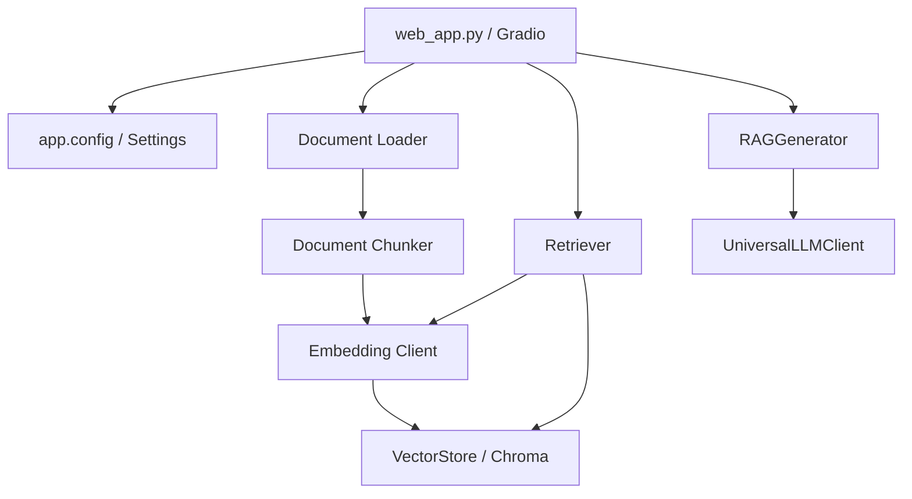

# DocuMind - RAG 系统架构（v1.2）

## 1. 分层结构



## 2. 文档索引流程

```text
上传校验
→ 文档加载
→ 生成稳定 document_id
→ 文档分块
→ 生成稳定 chunk_id
→ 批量 Embedding
→ Chroma upsert
```

关键约束：

- 仅允许 `.pdf`、`.docx`、`.txt`；
- 上传扩展名和大小由配置统一控制；
- PDF 页码写入 `page_number`，从 1 开始；
- 相同 Chunk ID 使用 `upsert`，重复上传不重复插入；
- 文档数、向量数和向量维度在写入前校验；
- Gradio 临时绝对路径不写入向量元数据。

## 3. 问答流程

```text
用户问题
→ Query Embedding
→ Chroma 距离检索
→ 最大距离阈值过滤
→ 构建带来源和页码的上下文
→ LLM 流式生成
→ UI 展示回答和引用来源
```

距离语义：

- `distance` 越小越相关；
- `score_threshold` 是允许的最大距离；
- `rerank_score` 越大越相关，不能覆盖原始 `distance`。

## 4. 配置边界

`app/config.py` 使用 Pydantic Settings 管理：

- Provider 和 API 配置；
- 分块、检索和生成参数；
- Chroma 数据目录；
- 上传限制；
- Web 监听地址；
- 日志级别、轮转和保留周期。

默认监听 `127.0.0.1`。当前系统没有认证，不应直接监听公网地址。

## 5. 异常语义

- 检索基础设施异常继续向上传播，不伪装成“没有结果”；
- Generator 层不把 Provider 错误转换为成功文本；
- Web 层记录完整异常，只向用户返回不含密钥、路径和 Provider 细节的通用错误；
- 流式生成异常不会重复追加用户消息。

## 6. 当前边界

v1.2 只完成分层重构和本地单用户基线收尾，暂不包含：

- Docker/Compose；
- 正式 Metrics 和 Tracing；
- 历史感知检索；
- 文档版本与索引重建状态机；
- 异步摄取、认证和多租户。
