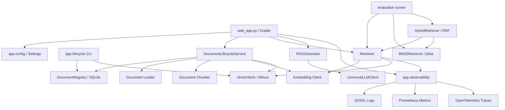

# DocuMind - RAG 系统架构（v1.7.1）

## 1. 分层结构



`app/core` 保持业务能力，`app/observability` 提供横切能力。业务层只调用稳定封装，不直接依赖 Prometheus 注册表、OpenTelemetry 全局 Provider 或日志文件实现。

## 2. 文档索引流程

```text
上传校验
→ 内容哈希源文件持久化
→ Registry claim（no-op / indexing）
→ 文档加载与分块
→ 生成 index_id / 稳定 chunk_id
→ 批量 Embedding 和维度校验
→ Embedding 空间兼容校验
→ Milvus upsert / Chunk ID 收敛
→ Chunk 数校验
→ Registry active 切换
→ 清理旧索引
```

关键约束：

- 仅允许 `.pdf`、`.docx`、`.txt`；
- 上传扩展名和大小由配置统一控制；
- PDF 页码写入 `page_number`，从 1 开始；
- 相同内容且 active Chunk 完整时在 claim 阶段 no-op；计数异常时自动重建修复；
- 新版本成功写入并校验后才切换 `active_index_id`，失败不会影响旧 active；
- 相同 Chunk ID 使用 `upsert`，并删除同一索引内非预期 ID，重复执行后集合精确收敛；
- 文档数、向量数和向量维度在写入前校验；
- 非空 Collection 的 Embedding Provider、模型和实际维度必须与当前配置一致；
- Gradio 临时绝对路径不写入向量元数据。

文档摄取 Trace：

```text
rag.document.ingest
├── document.load
├── document.chunk
├── embedding.batch
└── vector.upsert
```

## 3. 文档生命周期

`DocumentRegistry` 是文档和索引状态源，SQLite 表分别记录逻辑文档、内容版本、索引清单和操作进度。`document_key` 标识逻辑文档，`document_version_id` 标识源内容版本，`index_id` 标识该版本在某套解析、分块和 Embedding 清单下的索引。

索引切换遵循：

```text
source persist → claim → build → validate → activate → cleanup
```

`audit` 一次扫描 Milvus，报告旧索引、孤儿索引、缺失 active、active Chunk 数不一致和 v1.4 legacy Chunk。旧索引清理先落 `deleting`，再删除向量并落 `deleted`；进程在任一步中断后都可由下一次 `cleanup` 收敛。

`rebuild --dry-run` 不初始化 Embedding Provider，也不写入向量或状态。它先校验内容寻址源文件的 SHA-256，再用当前解析、分块和静态 Embedding 配置计算 planned fingerprint / `index_id`；Provider/模型未变化时复用注册表中已验证的真实维度，避免 Ollama 静态默认维度造成误判。

`rebuild --retry` 会在指定文档下寻找唯一的 `indexing` 目标。它既能恢复 active 索引的中断重建，也能恢复尚未切换 active 的新版本；没有目标或存在多个目标时拒绝猜测，配置已变化时要求恢复原配置或执行新的普通重建。

## 4. 问答流程

Web 默认问答链路保持 Dense-only：

```text
用户问题
→ Query Embedding
→ Milvus L2 距离检索
→ 最大距离阈值过滤
→ 构建带来源和页码的上下文
→ LLM 流式生成
→ UI 展示回答和引用来源
```

问答 Trace：

```text
rag.query
├── rag.retrieve
│   ├── embedding.query
│   └── vector.search
├── rag.context.build
└── llm.generate
```

距离语义：

- `distance` 越小越相关；
- `score_threshold` 是允许的最大距离；
- `rerank_score` 越大越相关，不能覆盖原始 `distance`。

v1.6 离线评估同时支持 BM25-only 和 Hybrid。BM25 使用 `jieba` 处理中文，并保留英文单词、配置项和错误码；Hybrid 分别扩大 Dense 与词法候选集，再按 Chunk ID 去重并执行 RRF：

```text
Dense ranks ─┐
             ├→ score(d) = Σ 1 / (60 + rank_i(d)) → Top-K
BM25 ranks ──┘
```

RRF 只使用名次，不直接比较 Milvus L2 `distance` 与 BM25 原始分数。v1.6.1 使用 `dense_weight/(rrf_k+dense_rank) + lexical_weight/(rrf_k+lexical_rank)`，候选深度由 `candidate_multiplier` 控制；零权重通道不执行检索。BM25 可用 `lexical_score_threshold` 拒绝低分词法候选。结果分别保留 `distance`、`lexical_score`、`dense_rank`、`lexical_rank` 和 `fusion_score`，方便审计来源。词法候选没有向量距离时，UI 不显示伪造的距离值。

v1.7 仅在评估编排中增加可选链路：

```text
原始问题 + Rewrite artifact
→ 每条查询独立检索
→ stable chunk_id 去重 + Query RRF
→ 扩大候选集
→ Cross-Encoder Reranker
→ Top-K 评估报告
```

原问题必须在改写列表首位；Query RRF 与 Hybrid RRF 分别保存，不能复用或覆盖 `fusion_score`。Cross-Encoder 只改变最终名次并写入 `rerank_score`，不会把其数值伪装成 Milvus distance。LLM 改写先生成与 schema 版本、Prompt SHA-256、生成参数和数据集 SHA-256 绑定的 artifact，之后的本地检索评估不访问 LLM；这使同一 artifact、语料和配置下的报告可复现。四模式比较还会校验 Embedding、分块、阈值和 Hybrid 参数完全一致，并分别报告质量与平均/P50/P95/最大延迟。

## 5. 可观测性架构

### 5.1 请求上下文

`contextvars` 保存 `request_id` 和 `trace_id`，支持同步生成器完整生命周期、嵌套恢复和异常清理。Tracing 开启后，当前 Span 的真实 Trace ID 会临时覆盖备用 Trace ID，使日志与 Trace 可关联。

### 5.2 日志

- 应用入口显式调用 `setup_logger()`；模块导入不创建文件。
- 控制台默认文本，文件默认 JSONL。
- 统一事件名、操作名、状态、数字耗时和异常类型。
- 日志 Patcher 负责字段补全和凭据脱敏。

### 5.3 Metrics

- `configure_metrics()` 只配置内存注册表。
- `start_metrics_server()` 只由 Web 主入口显式调用。
- 标签限制为 `provider`、`operation`、`status`、`error_type`。
- 关闭后所有操作 no-op，不监听端口。

### 5.4 Tracing

- 使用应用私有 `TracerProvider`，不覆盖 OpenTelemetry 全局 Provider。
- 默认关闭；没有 OTLP endpoint 时不创建网络 Exporter。
- Span 异常只记录 `error.type` 和 ERROR 状态，不发送默认异常事件。
- Span 属性过滤问题、Prompt、文档正文、文件名、凭据及高基数请求标识。

## 6. 配置边界

`app/config.py` 使用 Pydantic Settings 管理：

- Provider 和 API 配置；
- 分块、检索和生成参数；
- Milvus URI、Token 和 Database；
- 上传限制；
- Web 监听地址；
- 日志格式、轮转和保留周期；
- Metrics 开关、地址和端口；
- Tracing 开关和 OTLP/HTTP endpoint。

Web 和 Metrics 默认监听 `127.0.0.1`。当前系统没有认证，不应直接监听公网地址。

## 7. 异常语义

- 检索基础设施异常继续向上传播，不伪装成“没有结果”；
- Generator 层不把 Provider 错误转换为成功文本；
- Web 层记录脱敏后的完整本地异常，只向用户返回通用错误；
- 流式生成异常不会重复追加用户消息；
- 子 Span 自动标记错误；被 Web 层捕获的异常会显式标记根 Span。

## 8. 当前边界

v1.7 在 v1.6.1 检索校准层上增加严格 Rewrite artifact、多查询 RRF、Cross-Encoder Reranker 和独立分数报告。v1.7.1 的四模式同配置对照显示三种增强模式质量相同，Rewrite 的尾延迟最低，组合模式没有额外质量收益。评估层和生命周期层都不反向依赖 Web UI；样本规模和延迟证据仍不足以自动改变 Web 默认 Dense-only 链路。

```text
evaluation.runner / production_runner
├── evaluation.datasets       # v1.4 / v1.6 JSONL 黄金与 holdout 用例
├── evaluation.rewrite_artifacts # 带 schema/Prompt/数据集指纹的 LLM 改写输入
├── evaluation.adapters       # Dense / BM25 / Hybrid / Rewrite / Rerank 边界
├── evaluation.metrics        # 纯函数检索/拒答指标
├── evaluation.reports        # JSON/Markdown 报告
├── evaluation.comparison     # 四模式同配置质量/延迟矩阵
└── evaluation.regression     # 基线比较和下降门禁
```

当前仍不包含：

- Docker/Compose 和可观测性后端容器；
- 历史感知检索，以及 Query Rewrite / Reranker 的 Web 默认接入；
- Celery/Redis 异步摄取；
- 认证、多租户、限流和生产高可用。

日志、指标、追踪和评估配置分别见 `OBSERVABILITY.md` 与 `EVALUATION.md`。
