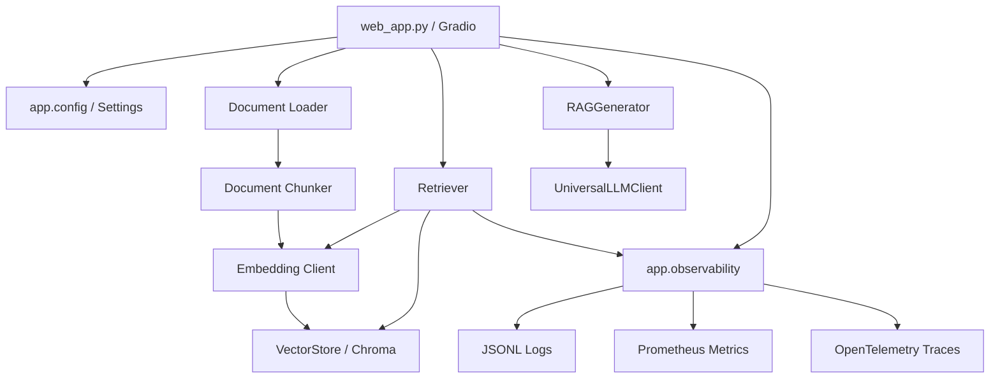

# DocuMind - RAG 系统架构（v1.4）

## 1. 分层结构



`app/core` 保持业务能力，`app/observability` 提供横切能力。业务层只调用稳定封装，不直接依赖 Prometheus 注册表、OpenTelemetry 全局 Provider 或日志文件实现。

## 2. 文档索引流程

```text
上传校验
→ 文档加载
→ 生成稳定 document_id
→ 文档分块
→ 生成稳定 chunk_id
→ 批量 Embedding
→ Chroma upsert
```

关键约束：

- 仅允许 `.pdf`、`.docx`、`.txt`；
- 上传扩展名和大小由配置统一控制；
- PDF 页码写入 `page_number`，从 1 开始；
- 相同 Chunk ID 使用 `upsert`，重复上传不重复插入；
- 文档数、向量数和向量维度在写入前校验；
- Gradio 临时绝对路径不写入向量元数据。

文档摄取 Trace：

```text
rag.document.ingest
├── document.load
├── document.chunk
├── embedding.batch
└── vector.upsert
```

## 3. 问答流程

```text
用户问题
→ Query Embedding
→ Chroma 距离检索
→ 最大距离阈值过滤
→ 构建带来源和页码的上下文
→ LLM 流式生成
→ UI 展示回答和引用来源
```

问答 Trace：

```text
rag.query
├── rag.retrieve
│   ├── embedding.query
│   └── vector.search
├── rag.context.build
└── llm.generate
```

距离语义：

- `distance` 越小越相关；
- `score_threshold` 是允许的最大距离；
- `rerank_score` 越大越相关，不能覆盖原始 `distance`。

## 4. 可观测性架构

### 4.1 请求上下文

`contextvars` 保存 `request_id` 和 `trace_id`，支持同步生成器完整生命周期、嵌套恢复和异常清理。Tracing 开启后，当前 Span 的真实 Trace ID 会临时覆盖备用 Trace ID，使日志与 Trace 可关联。

### 4.2 日志

- 应用入口显式调用 `setup_logger()`；模块导入不创建文件。
- 控制台默认文本，文件默认 JSONL。
- 统一事件名、操作名、状态、数字耗时和异常类型。
- 日志 Patcher 负责字段补全和凭据脱敏。

### 4.3 Metrics

- `configure_metrics()` 只配置内存注册表。
- `start_metrics_server()` 只由 Web 主入口显式调用。
- 标签限制为 `provider`、`operation`、`status`、`error_type`。
- 关闭后所有操作 no-op，不监听端口。

### 4.4 Tracing

- 使用应用私有 `TracerProvider`，不覆盖 OpenTelemetry 全局 Provider。
- 默认关闭；没有 OTLP endpoint 时不创建网络 Exporter。
- Span 异常只记录 `error.type` 和 ERROR 状态，不发送默认异常事件。
- Span 属性过滤问题、Prompt、文档正文、文件名、凭据及高基数请求标识。

## 5. 配置边界

`app/config.py` 使用 Pydantic Settings 管理：

- Provider 和 API 配置；
- 分块、检索和生成参数；
- Chroma 数据目录；
- 上传限制；
- Web 监听地址；
- 日志格式、轮转和保留周期；
- Metrics 开关、地址和端口；
- Tracing 开关和 OTLP/HTTP endpoint。

Web 和 Metrics 默认监听 `127.0.0.1`。当前系统没有认证，不应直接监听公网地址。

## 6. 异常语义

- 检索基础设施异常继续向上传播，不伪装成“没有结果”；
- Generator 层不把 Provider 错误转换为成功文本；
- Web 层记录脱敏后的完整本地异常，只向用户返回通用错误；
- 流式生成异常不会重复追加用户消息；
- 子 Span 自动标记错误；被 Web 层捕获的异常会显式标记根 Span。

## 7. 当前边界

v1.4 在应用内 Logs、Metrics、Traces 之上增加独立离线评估层。评估层只依赖 Adapter 协议，不反向依赖 Web UI。

```text
evaluation.runner
├── evaluation.datasets       # JSONL 黄金用例
├── evaluation.adapters       # 真实 Retriever 与 Fake Adapter 边界
├── evaluation.metrics        # 纯函数检索/拒答指标
├── evaluation.reports        # JSON/Markdown 报告
└── evaluation.regression     # 基线比较和下降门禁
```

当前仍不包含：

- Docker/Compose 和可观测性后端容器；
- 历史感知检索、Query Rewrite 和正式 Reranker；
- 文档版本与索引重建状态机；
- Celery/Redis 异步摄取；
- 认证、多租户、限流和生产高可用。

日志、指标、追踪和评估配置分别见 `OBSERVABILITY.md` 与 `EVALUATION.md`。
