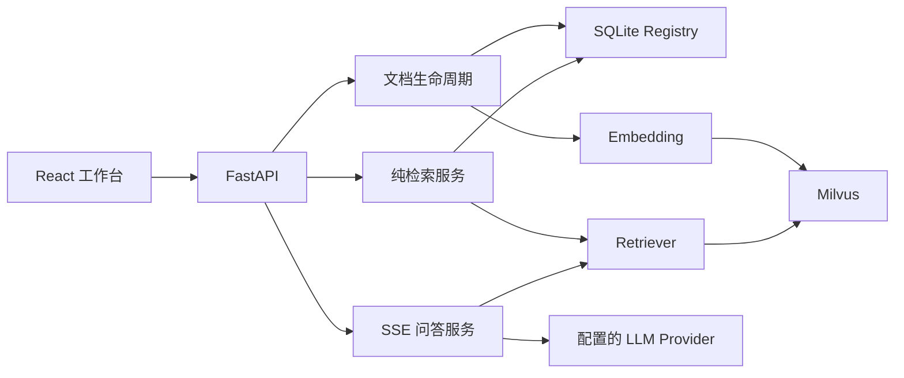

# DocuMind 3.0.0 · RAG 知识库

基于 **FastAPI、React 和 Milvus** 的本地知识库问答系统，提供文档摄取、流式回答、引用溯源和独立纯检索接口，并通过文档生命周期与离线评测约束数据一致性和能力变更。

> 适用于本地单用户或可信私网。当前主线保持 **Dense-only**，不提供公网认证、多租户隔离或高可用承诺。

## 核心能力

- **文档管理**：支持 PDF、DOCX、TXT，内容哈希持久化、幂等摄取、索引版本及 active 原子切换。
- **交互式问答**：React 工作台通过 SSE 展示生成过程、引用来源和中断状态，支持本地对话记录。
- **机器检索接口**：`POST /api/v1/retrieve` 返回指定文档的原始 Chunk，不调用生成模型；固定 Schema `1.0`、`dense-v1`。
- **可靠性**：依赖探活；纯检索执行具备有界超时、重试、进程内并发限制及失效索引校验。
- **可观测性**：结构化 JSONL 日志、Prometheus Metrics、可选 OpenTelemetry Tracing 与凭据脱敏。
- **质量验证**：确定性 CI 回归门禁，以及独立的检索、答案质量和增强方案对照评测。

## 架构概览



Milvus Standalone 的 etcd、MinIO 由 Compose 编排；Ollama 和生成模型服务不包含在这组容器内。详细模块职责见[架构说明](docs/ARCHITECTURE.md)。

## 版本与迁移

当前源码使用 `3.0.0` 版本标识。新版统一采用 React/FastAPI/Milvus，不再提供 Gradio 启动入口；应用相对路径和默认环境文件以项目根为基准。旧版用户先阅读[3.0.0 迁移说明](docs/MIGRATION_3_0.md)。纯检索 Schema 仍为 `1.0`，`dense-v1` 不变。

旧架构入口为 `v1.7.1`（Chroma/Gradio），需要时检出对应标签并使用该快照的说明。源码版本标识不等于 GitHub Release 已发布；实际发布以对应标签与发布页为准。

## 环境要求

| 场景 | 需要准备 |
|---|---|
| Compose 运行 | Docker Engine / Docker Desktop + Compose；可访问的 Embedding 与 LLM Provider |
| 默认 Embedding | 本机 Ollama 已运行，并安装 `qwen3-embedding` |
| 本地开发 | Python 3.11、Node.js 22，以及运行中的 Milvus |
| 离线回归测试 | 安装开发依赖；确定性测试不需要真实模型或数据库 |

Python 直接依赖见 `requirements.txt`，前端使用 `package-lock.json`；Python 依赖目前不是完整锁定快照。安装与可复现性边界见[依赖说明](docs/DEPENDENCIES.md)。

## 快速开始

以下命令使用 PowerShell，默认从仓库根目录执行。

### 准备配置与模型

```powershell
if (-not (Test-Path .env)) { Copy-Item .env.example .env }
ollama pull qwen3-embedding
```

先确认 Ollama 服务可用；需要手动启动时，在**单独终端**运行 `ollama serve`。随后编辑本地 `.env`，设置 `DEFAULT_LLM_PROVIDER` 和对应凭据，不要将真实配置提交到 Git。

默认生成 Provider 为 OpenAI，因此 Web 问答并非默认完全离线。纯检索不调用生成模型，但仍依赖 Embedding、Milvus 和有效文档索引。

### 启动与检查

```powershell
docker compose up -d --build
docker compose ps
Invoke-RestMethod http://127.0.0.1:8001/api/v1/health/live
Invoke-RestMethod http://127.0.0.1:8001/api/v1/health/ready
```

| 入口 | 默认地址 |
|---|---|
| React 工作台 | `http://127.0.0.1:5173` |
| API / Swagger | `http://127.0.0.1:8001/docs` |
| Metrics | `http://127.0.0.1:8000/metrics` |
| Milvus | `127.0.0.1:19530` |

打开工作台，上传文档，等待索引进入 active 状态，再进行问答或调用检索接口。`live` 只表示进程存活；`ready` 才反映依赖状态。若生成服务不可用但 `components.retrieval=ready`，可使用纯检索，不能据此认为问答可用。

容器默认通过 `host.docker.internal:11434` 访问宿主机 Ollama。Embedding 默认有 600 秒有界驻留和独立的 60 秒 readiness 冷加载窗口；遇到首次探活失败、端口冲突或资源不足，参见[运行与故障处理](docs/DEMO_SCRIPT.md)。

### 安全停止

```powershell
docker compose stop
```

`docker compose down` 可移除容器和网络并保留命名卷。**不要在需要保留知识库时使用 `down -v`**。本地开发的 API 与前端启动步骤见[运行说明](docs/DEMO_SCRIPT.md)。

## 目录与配置

| 位置 | 职责 |
|---|---|
| `app/` / `frontend/` | 后端与前端源码 |
| `tests/` / `frontend/e2e/` | 后端测试与浏览器流程测试 |
| `data/` | 注册表及上传文件；内容不提交 |
| `logs/` / `artifacts/` | 日志与新生成的验证报告；内容不提交 |
| `evaluation/` | 固定数据集、基线、评测工具和历史证据 |
| `_private/` | 可选的本地私人资料目录，Git/Docker 均排除 |

默认 `.env` 和相对应用数据/日志路径以项目根解析；绝对路径覆盖继续有效。配置加载不创建文件，启动时准备必要目录。Docker 使用现有 `/app/data`、`/app/logs` 持久化位置，不会因更换终端目录自动迁移数据。

`data`、`logs`、`artifacts` 仅跟踪目录占位规则。明确传给评测 CLI 的相对输入/输出仍按调用者工作目录解释，绝对路径保持原位置。完整职责见[项目结构](docs/PROJECT_STRUCTURE.md)。

## 评测与验证

### 先运行确定性回归

在安装开发依赖的 Python 环境中执行：

```powershell
python -m pytest -q
python -m evaluation.runner --output-json artifacts/evaluation/current.json --output-markdown artifacts/evaluation/current.md
python -m evaluation.regression_runner --baseline evaluation/baselines/deterministic_dense_v2.json --current artifacts/evaluation/current.json
```

确定性检索使用固定数据、哈希 Embedding 和内存向量存储，不需要真实 Provider。真实 Milvus 集成有单独的显式开关；不要把默认测试通过解释为真实依赖或最终生产部署已通过。前端与完整检查命令见[运行说明](docs/DEMO_SCRIPT.md)。

### 历史证据摘要

| 证据 | 结论与边界 |
|---|---|
| DS-06 检索对照 | 75 份合成代表性文档、235 Chunk，validation/holdout 各 50 题。Reranker 的 MRR@3 从 **0.3018 提升至 0.4459**，但 P95 从 **170.25 ms 增至 1102.93 ms**，超出预设延迟门禁，因此不替换 Dense 主线。 |
| 答案质量对照 | 历史报告暴露拒答和统一引用等限制；检索命中不等于回答正确，不能宣称任意模型或用户文档都达到相同质量。 |
| ScholarTrace 联调 | 已有对应基线的真实上传/检索与 Evidence 校验记录；证明限定条件下的接口集成，不代表当前版本的独立部署验收或大规模吞吐。 |

详见[DS-06 决策](evaluation/reports/p2_ds06_final_decision_v1.md)、[评测文档](docs/EVALUATION.md)和[历史交付证据](docs/PROJECT_FREEZE_2.md)。数据集、指标、报告日期与依赖配置是证据的一部分，不将旧报告伪装成当前版本的新测试结果。

## 使用边界

- 文档摄取同步执行；没有后台任务队列、租户鉴权或高可用部署保证。
- Web 主线与公共纯检索接口保持 Dense-only；BM25、Hybrid、Rewrite、Reranker 是离线实验能力。
- `/retrieve` 要求一个 `document_key` 和匹配的 `expected_index_id`；不提供跨文档批量、结果缓存或 MCP 接口。
- L2 阈值与 Embedding 空间、语料相关，没有可靠通用默认阈值；保留拒答和引用质量的已知限制。
- 不可信上下文隔离及测试不等于全面安全保证；不要直接暴露到公网。
- Prometheus、Grafana、Jaeger、Collector 等外部可观测性后端不在当前 Compose 中。

## 文档导航

| 文档 | 内容 |
|---|---|
| [架构说明](docs/ARCHITECTURE.md) | 模块依赖、文档/索引不变量、服务边界 |
| [运行与故障处理](docs/DEMO_SCRIPT.md) | 本地/容器启动、检查、维护与停止 |
| [项目结构](docs/PROJECT_STRUCTURE.md) | 源码、测试、运行产物的归属 |
| [依赖说明](docs/DEPENDENCIES.md) | 安装方式与依赖锁定边界 |
| [纯检索 API](docs/RETRIEVE_API.md) | 请求、响应、错误码、资源控制 |
| [ScholarTrace 接入](docs/SCHOLARTRACE_INTEGRATION.md) | Consumer 流程及兼容边界 |
| [评测文档](docs/EVALUATION.md) | 当前回归操作与按版本归档的实验记录 |
| [可观测性](docs/OBSERVABILITY.md) | 日志、指标、Trace 与隐私约束 |
| [版本演进](docs/VERSION_HISTORY.md) | 主要架构节点与历史版本差异 |
| [3.0.0 迁移](docs/MIGRATION_3_0.md) | 入口、配置与路径兼容变化 |

当前源码说明与历史标签是不同入口；需要旧架构时应检出对应标签，使用该快照自带的依赖和说明。不要将历史发布记录视为任意当前工作树已经发布的证明。
